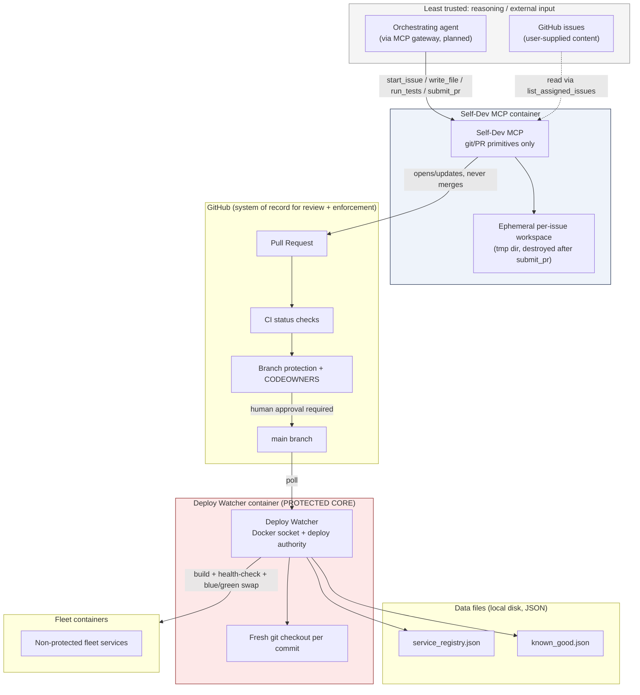
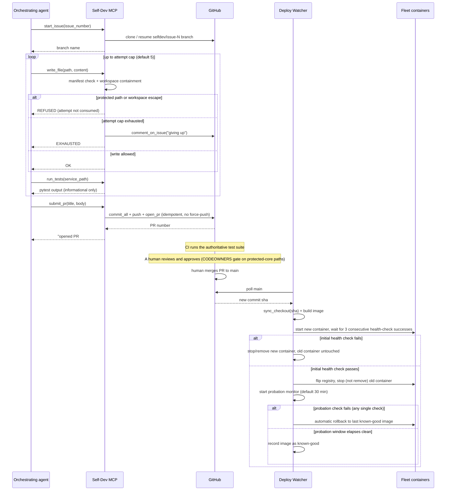

# Architecture

This document describes Fleet MCP's components, their trust boundaries, the
end-to-end self-dev cycle, and the data files the system relies on. It
reflects the code in `services/` and `tests/` as of the `0.1.0` foundation,
plus the specs it was built from:
[self-dev-mcp design](docs/superpowers/specs/2026-09-19-self-dev-mcp-design.md)
and
[model adapters + credentials manager design](docs/superpowers/specs/2026-09-19-model-adapters-and-credentials-manager-design.md).
Anything marked **(planned)** below has no implementation in this repo yet.

## Components and trust boundaries



The trust boundary that matters most is the one around the Deploy Watcher
container: it is the only component with Docker socket access and deploy
credentials, it is marked `protected: true` in the fleet manifest, and — per
`services/deploy_watcher/*` — it never imports anything from
`services/self_dev_mcp`. The two services are isolated at the source level,
not just by manifest configuration; there is no code path by which running
the Deploy Watcher pulls in Self-Dev MCP logic or vice versa.

The Self-Dev MCP container is comparatively low-trust by design: it is
expected to execute code an LLM generated (via `run_tests`), so it is given
the least authority that still lets it do its job — git and GitHub API
calls, and file I/O confined to a throwaway workspace. It cannot reach the
Deploy Watcher's authority by any path this repo defines.

## The self-dev cycle



Key properties enforced in code, not just by convention:

- `start_issue` checks for an existing remote `selfdev/issue-N` branch and
  resumes it (`git_ops.remote_branch_exists` /
  `git_ops.checkout_remote_branch`) instead of branching fresh, so review
  follow-ups land on the same PR.
- `github_client.open_pr` checks for an already-open PR on that branch/base
  before creating one — idempotent by construction, not by luck.
- Nothing in `services/self_dev_mcp/` calls a merge API. The only GitHub
  write operations it performs are `create_pull`, `create_comment`, and
  push — never a merge.
- `run_tests` is explicitly informational: the plan and spec are clear that
  the **authoritative** test run is GitHub Actions CI, triggered after push,
  not the local run inside Self-Dev MCP's own container.

## Rollback state machine

```mermaid
stateDiagram-v2
    [*] --> Building: new commit sha polled

    Building --> DeployFailed: image build error
    Building --> Starting: image built

    Starting --> DeployFailed: container run error (leftover container force-removed)
    Starting --> InitialHealthCheck: container started

    InitialHealthCheck --> DeployFailed: 3 consecutive successes not reached before timeout
    InitialHealthCheck --> Promoted: 3 consecutive health-check successes

    DeployFailed --> [*]: new container stopped/removed; previously-active container untouched

    Promoted --> Probation: registry flipped to new container; old container stopped (not removed)

    Probation --> RollingBack: any single failed check within the probation window
    Probation --> KnownGood: full probation window elapses with zero failed checks

    RollingBack --> RolledBackServing: known-good image found, started, registry flipped to rollback container
    RollingBack --> RollbackNoOp: no known-good image on record yet (first-ever deploy still in probation)

    KnownGood --> [*]: image tag recorded as known-good; continues serving
    RolledBackServing --> [*]
    RollbackNoOp --> [*]: live (unhealthy) container left running rather than stopped with nothing to replace it
```

Notes that don't fit in the diagram:

- A retired commit sha (a container name that already exists but isn't the
  active one — e.g. it was promoted once and later rolled back or
  superseded) is refused at the very start of `deploy()`, before
  `Building`, rather than colliding on the container name.
- The probation monitor re-reads the registry before acting
  (`_rollback`/`_perform_rollback`): if a newer deploy has already
  superseded the container being probated, the stale monitor does nothing
  instead of rolling back a deploy that's no longer live.
- `RollbackNoOp` is deliberate, not a bug: rolling back with nothing proven
  to roll back *to* would mean stopping the only running container for no
  gain. The spec's "known-good floor" guarantee is what this state
  preserves.
- Every Docker-facing call in this state machine is wrapped so that
  `deploy()` and the probation monitor never raise to their caller — a
  Docker error becomes a failed `DeployResult` or a logged, treated-as-failed
  probation check, never an unhandled exception that could kill the poll
  loop.

## Protected-core enforcement layers

Three independent layers, so a bug in any one of them doesn't remove the
protection:

1. **Tool level** (`services/self_dev_mcp/tools.py`, `write_file`) —
   checks `FleetManifest.is_path_protected` before touching disk, and
   separately enforces workspace containment
   (`_resolve_inside_workspace`) so a path can't escape the ephemeral
   workspace even if it were somehow not manifest-protected. The attempt
   cap gate (`AttemptTracker.try_record_attempt`) is atomic and is the
   final check before a write actually happens.
2. **Manifest level, with hardcoded exceptions**
   (`services/common/manifest.py`) — `FleetManifest.is_path_protected`
   protects any path under a service marked `protected: true`, any path
   listed in a service's `protected_paths`, and unconditionally protects
   `fleet_manifest.yaml` and `services/common/manifest.py` themselves via
   `ALWAYS_PROTECTED_PATHS` — regardless of what the loaded manifest says.
   Path comparison normalizes backslashes to `/`, resolves `..` via
   `posixpath.normpath`, case-folds, and treats anything that still starts
   with `..` (escapes the repo root) as protected.
3. **Platform level, via GitHub** (configured, not code) — branch
   protection requiring the CI status check and human review, plus a
   CODEOWNERS entry naming a human owner for protected-core paths. This is
   the layer that still holds even if layers 1 and 2 had a bug — it's
   external to this codebase entirely, which is the point.

A fourth, structural layer isn't a "check" at all: the Self-Dev MCP process
holds no Docker socket and no deploy credentials, so even a complete bypass
of layers 1–3 inside that process still couldn't build or run a container —
there's no code path to reach that capability from inside Self-Dev MCP.

## Service isolation

`services/deploy_watcher/` contains no import of, or reference to,
`services/self_dev_mcp`, and vice versa. This isn't just tidiness — it's a
property this document (and a `grep` you can run yourself) can verify
directly: `services/self_dev_mcp` never imports `docker`, and
`services/deploy_watcher` never imports `services.self_dev_mcp`. The two
services communicate only indirectly, through GitHub (Self-Dev MCP pushes
commits that a human merges; Deploy Watcher polls `main` for the result) —
there is no in-process call path between them.

## Data files

Two JSON files back the Deploy Watcher's state, both written through
`services/deploy_watcher/json_store.write_json_atomic` (temp file in the
same directory, `fsync`, then `os.replace`), so a crash mid-write can never
leave a corrupt or partially-written file:

- **Service registry** (`services/deploy_watcher/registry.py`,
  `ServiceRegistry`) — maps `service_name -> active_container_name`. This is
  described in the source as "a file-backed stand-in for the MCP gateway's
  routing table" — once the MCP gateway (planned) exists, it is expected to
  read from this same file rather than the Deploy Watcher growing its own
  routing API.
- **Known-good store** (`services/deploy_watcher/known_good.py`,
  `KnownGoodStore`) — maps `service_name -> last-proven image tag`. Only
  written by the probation monitor after a full probation window with zero
  failures; this file is what `rollback()` reads to decide what to roll
  back to.

Both are simple `dict`s keyed by service name, loaded and rewritten in full
on every write (fine at fleet scale; would need revisiting for a very large
fleet or high write frequency).

## Planned: model-adapter and credentials-manager subsystem

**Nothing in this section is implemented.** It's documented here because
it's the next planned extension of this same pipeline, and because it
changes the protected-core picture slightly. See the [model adapters +
credentials manager design
spec](docs/superpowers/specs/2026-09-19-model-adapters-and-credentials-manager-design.md)
for the full design.

- **`model-adapters-mcp`** (planned, not protected) — a fleet service
  dispatching `chat(model_name, messages, tools)` to per-provider adapter
  modules behind a common `ModelAdapter` interface. Each adapter loads in
  its own `try`/`except` at registry startup so one broken adapter can't
  take down the others.
- **`credentials-manager`** (planned, **deliberately not part of the
  protected core**) — holds every secret in the fleet behind a
  `CredentialStore` interface (a local Fernet-encrypted file to start), with
  per-service access scoping. It's intentionally left editable by Self-Dev
  MCP so new storage backends can be added without a human hand-writing the
  integration; the blast radius of that choice is mitigated by keeping
  `access_policy.yaml` itself a protected *path* within that otherwise
  editable service, and by defaulting new credentials to an allowlist of
  just their declared owner service.
- **Model Manager** (planned, orchestrator-side logic, not a new service) —
  the chat-facing flow that detects an unsupported model, asks the user
  whether to add it, collects the credential via `credentials-manager`, and
  drives Self-Dev MCP with a synthetic (non-GitHub-issue) task to scaffold
  the new adapter.
- **`finalize_mode` extension to Self-Dev MCP** (planned) — generalizes the
  current PR-only `handle_submit_pr` into `handle_finalize(mode=...)` with
  three modes: `pr` (today's behavior), `local` (direct push to `main`,
  falling back to opening a PR if branch protection rejects the push), and
  `issue_only` (files a GitHub issue and writes no code). None of this
  exists in `services/self_dev_mcp/server.py` yet — `handle_submit_pr` is
  the only finalize path today.

Until these are built, do not assume a `model-adapters-mcp` or
`credentials-manager` container exists in any deployment of this repo.
