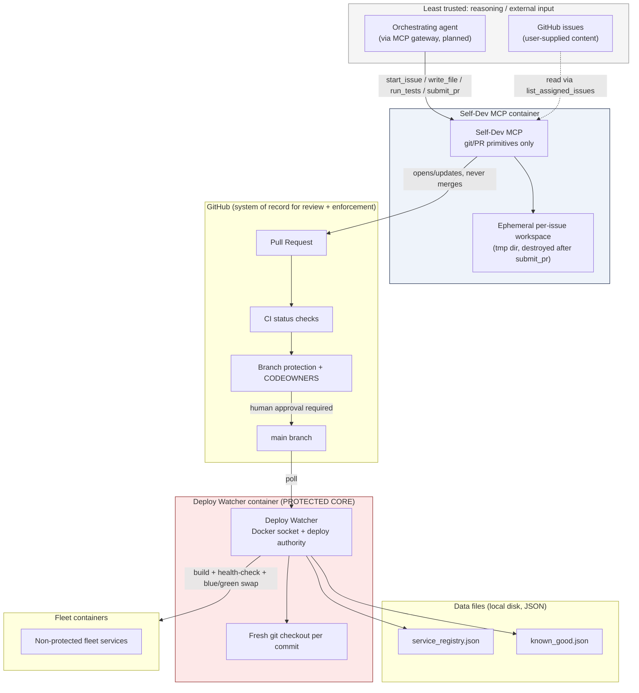
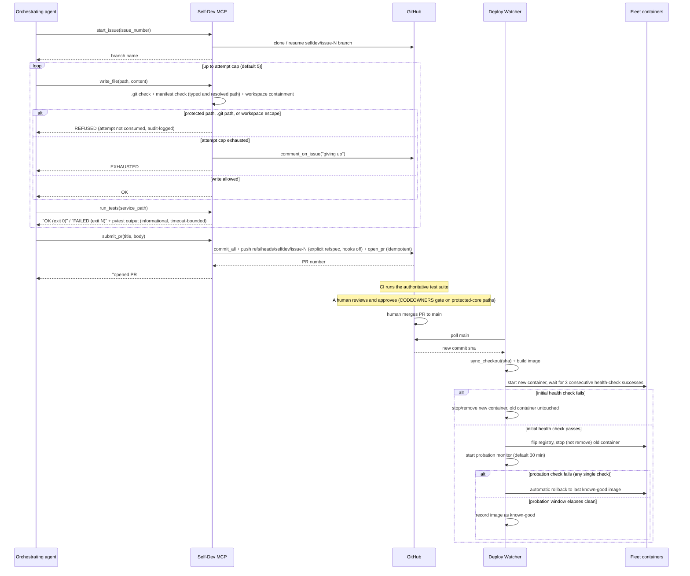

# Architecture

This document describes Flotilla MCP's components, their trust boundaries, the
end-to-end self-dev cycle, and the data files the system relies on. It
reflects the code in `flotilla_mcp/` and `tests/` as of the `0.1.0` foundation,
plus the specs it was built from:
[self-dev-mcp design](docs/design/2026-09-19-self-dev-mcp-design.md)
and
[model adapters + credentials manager design](docs/design/2026-09-19-model-adapters-and-credentials-manager-design.md).
Anything marked **(planned)** below has no implementation in this repo yet.

## Components and trust boundaries



The trust boundary that matters most is the one around the Deploy Watcher
container: it is the only component with Docker socket access and deploy
credentials, it is marked `protected: true` in the fleet manifest, and — per
`flotilla_mcp/deploy_watcher/*` — it never imports anything from
`flotilla_mcp/self_dev_mcp`. The two services are isolated at the source level,
not just by manifest configuration; there is no code path by which running
the Deploy Watcher pulls in Self-Dev MCP logic or vice versa.

The Self-Dev MCP container is comparatively low-trust by design: it is
expected to execute code an LLM generated (via `run_tests`), so it is given
the least authority that still lets it do its job: git and GitHub API calls
with its own `SELF_DEV_GITHUB_TOKEN`, and file I/O confined to a throwaway
workspace under `/app/tmp`. Its app source is root-owned and read-only to
the `selfdev` user. It holds no Docker socket and no watcher token, so it
cannot reach the Deploy Watcher's authority by any path this repo defines.

Be precise about what *inside* that container binds an agent. The tool
checks (`write_file`/`read_file`/`run_tests` path validation) bind a
**cooperative** agent. Code the agent writes and runs through `run_tests`
is not bound by them. It runs as `selfdev` with the self-dev token
reachable, can write any workspace file (protected paths and `.git/`
included), which `submit_pr`'s `git add -A` commits, and can call the
GitHub API directly. For a hostile agent the effective boundary is GitHub's:
branch protection (required `test` check, required review, code-owner
review, `enforce_admins`) and a separate bot identity for self-dev. See
[Protected-core enforcement layers](#protected-core-enforcement-layers) and
[SECURITY.md#known-limitations](SECURITY.md#known-limitations).

A separate, orthogonal boundary is the Self-Dev MCP's HTTP transport
(`--transport http`, used when it's deployed under `docker-compose.yml`):
its SSE endpoint (`/sse`, `/messages/`) has no authentication of its own,
so reachability of the port *is* the access control. `docker-compose.yml`
binds it to `127.0.0.1` for exactly this reason. This is a network-exposure
boundary, not an authority boundary — it doesn't change what the container
can do, only who can ask it to do it. See
[SECURITY.md#known-limitations](SECURITY.md#known-limitations) for the full
writeup and the planned MCP gateway as its eventual fix.

## The self-dev cycle



Key properties enforced in code, not just by convention:

- `start_issue` checks for an existing remote `selfdev/issue-N` branch and
  resumes it (`git_ops.remote_branch_exists` /
  `git_ops.checkout_remote_branch`) instead of branching fresh, so review
  follow-ups land on the same PR.
- `github_client.open_pr` checks for an already-open PR on that branch/base
  before creating one — idempotent by construction, not by luck.
- Nothing in `flotilla_mcp/self_dev_mcp/` calls a merge API. The only GitHub
  write operations it performs are `create_pull`, `create_comment`, and a
  push of `refs/heads/selfdev/issue-N` (explicit, non-forcing refspec). The
  token itself can do more, which is why branch protection is required.
- Every self-dev `git` call runs with `core.hooksPath=<empty dir>`,
  `core.fsmonitor=false`, cleared credential helpers plus one env-reading
  helper, and `GIT_TERMINAL_PROMPT=0` (`git_ops._run_git`).
- MCP tools are `async` and run their blocking handler in a worker thread
  (`anyio.to_thread.run_sync`), so `run_tests` (bounded by
  `SELF_DEV_TEST_TIMEOUT_SECONDS`, default 600) never blocks `/health`.
- `run_tests` is explicitly informational: the plan and spec are clear that
  the **authoritative** test run is GitHub Actions CI, triggered after push,
  not the local run inside Self-Dev MCP's own container.

## Deployment model

- **Self-Dev MCP is compose-managed only (this release).** Its
  `fleet_manifest.yaml` entry has no `container`, and the watcher only
  deploys services that are unprotected *and* have a `container`. An
  operator updates it with `docker compose up --build self-dev-mcp`. The
  watcher can't yet inject a service's environment (tokens, remotes) into
  the containers it starts; that is on the roadmap.
- **Watcher deploys run beside compose-managed instances.** A watcher deploy
  of, say, `fixture-hello-mcp` starts `fixture-hello-mcp-<sha>` next to the
  compose-managed `fixture-hello-mcp` container. It neither stops nor
  replaces compose's container.
- **Health-check URL convention.** The watcher health-checks
  `http://<service>-<sha>:8080/health`, resolved on the `mcp-fleet` network
  (`DeployManager`'s default `health_url_resolver`). A manifest entry's
  `health_check` field is **informational only**: it is parsed, but no code
  uses it.
- **Per-service locking.** `DeployManager` holds a per-service lock across
  every "read active → act → write active" section (the deploy flip,
  `rollback`/`_rollback`'s check-and-perform, and probation's known-good
  promotion). It is never held across a build or the initial health wait.

## Rollback state machine

```mermaid
stateDiagram-v2
    [*] --> Building: new commit sha polled

    Building --> DeployFailed: image build error
    Building --> Starting: image built

    Starting --> DeployFailed: container run error (leftover container force-removed)
    Starting --> InitialHealthCheck: container started

    InitialHealthCheck --> DeployFailed: 3 consecutive successes not reached before timeout
    InitialHealthCheck --> Promoted: 3 consecutive health-check successes

    DeployFailed --> [*]: new container stopped/removed; previously-active container untouched

    Promoted --> Probation: registry flipped to new container; old container stopped (not removed)

    Probation --> RollingBack: any single failed check within the probation window
    Probation --> KnownGood: full probation window elapses with zero failed checks

    RollingBack --> RolledBackServing: known-good image found, started, registry flipped to rollback container
    RollingBack --> RollbackNoOp: no known-good image on record yet (first-ever deploy still in probation)

    KnownGood --> [*]: image tag recorded as known-good; continues serving
    RolledBackServing --> [*]
    RollbackNoOp --> [*]: live (unhealthy) container left running rather than stopped with nothing to replace it
```

Notes that don't fit in the diagram:

- A retired commit sha (a container name that already exists but isn't the
  active one — e.g. it was promoted once and later rolled back or
  superseded) is refused at the very start of `deploy()`, before
  `Building`, rather than colliding on the container name.
- The probation monitor re-reads the registry before acting
  (`_rollback`/`_perform_rollback`): if a newer deploy has already
  superseded the container being probated, the stale monitor does nothing
  instead of rolling back a deploy that's no longer live.
- `RollbackNoOp` is deliberate, not a bug: rolling back with nothing proven
  to roll back *to* would mean stopping the only running container for no
  gain. The spec's "known-good floor" guarantee is what this state
  preserves.
- Every Docker-facing call in this state machine is wrapped so that
  `deploy()` and the probation monitor never raise to their caller — a
  Docker error becomes a failed `DeployResult` or a logged, treated-as-failed
  probation check, never an unhandled exception that could kill the poll
  loop.

## Protected-core enforcement layers

Layers 1 and 2 bind a **cooperative** agent, one that edits only through
the tools. Layer 3 is the only one that binds a **hostile** agent, because
agent-written code executed by `run_tests` bypasses layers 1 and 2 entirely
(it can write any workspace file, which `submit_pr` commits with
`git add -A`, and can call the GitHub API with the self-dev token).

1. **Tool level** (`flotilla_mcp/self_dev_mcp/tools.py`,
   `_validate_workspace_path`). `write_file` refuses absolute, drive-letter
   and UNC paths, any path with a `.git` component, and any path the
   manifest protects. It checks both the typed path and the
   symlink/junction-resolved target relative to the resolved workspace
   root, and enforces workspace containment. `read_file` and `run_tests`
   get the same `.git` and containment checks (`run_tests` also refuses
   option-like paths). Every refusal is audit-logged on `flotilla_mcp.audit`.
   The attempt cap gate (`AttemptTracker.try_record_attempt`) is atomic and
   is the final check before a write happens. Git invocations
   (`git_ops._run_git`) disable hooks and fsmonitor, and `push` uses an
   explicit non-forcing refspec, so even a tampered `.git/config` can't
   redirect a push onto `main` or run a hook.
2. **Manifest level, with hardcoded exceptions**
   (`flotilla_mcp/common/manifest.py`). `FleetManifest.is_path_protected`
   protects any path under a service marked `protected: true`, any path
   listed in a service's `protected_paths`, and, regardless of what the
   loaded manifest says, the exact files in `ALWAYS_PROTECTED_PATHS`
   (`fleet_manifest.yaml`, `flotilla_mcp/common/manifest.py`,
   `flotilla_mcp/__init__.py`, `requirements.txt`, `requirements-dev.txt`,
   `docker-compose.yml`, `pyproject.toml`, `.gitattributes`,
   `.gitignore`) and the subtrees in
   `ALWAYS_PROTECTED_PREFIXES` (`flotilla_mcp/common/`, `.github/`).
   `canonicalize_path` normalizes both sides identically: backslashes to
   `/`, `.`/`..` via `posixpath.normpath`, NTFS `:stream` suffixes and
   trailing dots/spaces stripped per component, case-folded. Anything that
   still starts with `..` (escapes the repo root) is protected. The
   `self-dev-mcp` entry itself stays unprotected, so self-dev can improve
   its own service.
3. **Platform level, via GitHub** (configured, not code): branch
   protection requiring the `test` CI status check, a required review,
   code-owner review and `enforce_admins`, plus a CODEOWNERS entry naming a
   human owner for every protected-core path (CODEOWNERS mirrors layer 2; a
   test enforces it), **and** a separate bot identity for self-dev, so the
   agent's PRs need someone else's approval. This is the real backstop,
   and it is external to this codebase. It is not active by default:
   CODEOWNERS now names a real owner, but a repo admin still has to run
   the command in
   [CONTRIBUTING.md#enabling-branch-protection](CONTRIBUTING.md#enabling-branch-protection)
   to make code-owner review enforced instead of advisory,
   and on a private repo branch protection needs a paid GitHub plan. It is
   a stated
   [precondition](SECURITY.md#preconditions-before-pointing-a-live-agent-at-a-repo)
   for pointing a live agent at a repo.

A fourth, structural layer isn't a "check" at all: the Self-Dev MCP process
holds no Docker socket and no deploy credentials, so even agent code running
under `run_tests` can't build or run a container directly. It can still
propose one, since a merged change to an unprotected service with a
`container` entry is deployed by the watcher. That is why layer 3's human
review matters.

## Service isolation

`flotilla_mcp/deploy_watcher/` contains no import of, or reference to,
`flotilla_mcp/self_dev_mcp`, and vice versa. This isn't just tidiness — it's a
property this document (and a `grep` you can run yourself) can verify
directly: `flotilla_mcp/self_dev_mcp` never imports `docker`, and
`flotilla_mcp/deploy_watcher` never imports `flotilla_mcp.self_dev_mcp`. The two
services communicate only indirectly, through GitHub (Self-Dev MCP pushes
commits that a human merges; Deploy Watcher polls `main` for the result) —
there is no in-process call path between them.

## Data files

Two JSON files back the Deploy Watcher's state, both written through
`flotilla_mcp/deploy_watcher/json_store.write_json_atomic` (temp file in the
same directory, `fsync`, then `os.replace`), so a crash mid-write can never
leave a corrupt or partially-written file:

- **Service registry** (`flotilla_mcp/deploy_watcher/registry.py`,
  `ServiceRegistry`) — maps `service_name -> active_container_name`. This is
  described in the source as "a file-backed stand-in for the MCP gateway's
  routing table" — once the MCP gateway (planned) exists, it is expected to
  read from this same file rather than the Deploy Watcher growing its own
  routing API.
- **Known-good store** (`flotilla_mcp/deploy_watcher/known_good.py`,
  `KnownGoodStore`) — maps `service_name -> last-proven image tag`. Only
  written by the probation monitor after a full probation window with zero
  failures; this file is what `rollback()` reads to decide what to roll
  back to.

Both are simple `dict`s keyed by service name, loaded and rewritten in full
on every write (fine at fleet scale; would need revisiting for a very large
fleet or high write frequency).

## Planned: model-adapter and credentials-manager subsystem

**Nothing in this section is implemented.** It's documented here because
it's the next planned extension of this same pipeline, and because it
changes the protected-core picture slightly. See the [model adapters +
credentials manager design
spec](docs/design/2026-09-19-model-adapters-and-credentials-manager-design.md)
for the full design.

- **`model-adapters-mcp`** (planned, not protected) — a fleet service
  dispatching `chat(model_name, messages, tools)` to per-provider adapter
  modules behind a common `ModelAdapter` interface. Each adapter loads in
  its own `try`/`except` at registry startup so one broken adapter can't
  take down the others.
- **`credentials-manager`** (planned, **deliberately not part of the
  protected core**) — holds every secret in the fleet behind a
  `CredentialStore` interface (a local Fernet-encrypted file to start), with
  per-service access scoping. It's intentionally left editable by Self-Dev
  MCP so new storage backends can be added without a human hand-writing the
  integration; the blast radius of that choice is mitigated by keeping
  `access_policy.yaml` itself a protected *path* within that otherwise
  editable service, and by defaulting new credentials to an allowlist of
  just their declared owner service.
- **Model Manager** (planned, orchestrator-side logic, not a new service) —
  the chat-facing flow that detects an unsupported model, asks the user
  whether to add it, collects the credential via `credentials-manager`, and
  drives Self-Dev MCP with a synthetic (non-GitHub-issue) task to scaffold
  the new adapter.
- **`finalize_mode` extension to Self-Dev MCP** (planned) — generalizes the
  current PR-only `handle_submit_pr` into `handle_finalize(mode=...)` with
  three modes: `pr` (today's behavior), `local` (direct push to `main`,
  falling back to opening a PR if branch protection rejects the push), and
  `issue_only` (files a GitHub issue and writes no code). None of this
  exists in `flotilla_mcp/self_dev_mcp/server.py` yet — `handle_submit_pr` is
  the only finalize path today.

Until these are built, do not assume a `model-adapters-mcp` or
`credentials-manager` container exists in any deployment of this repo.
