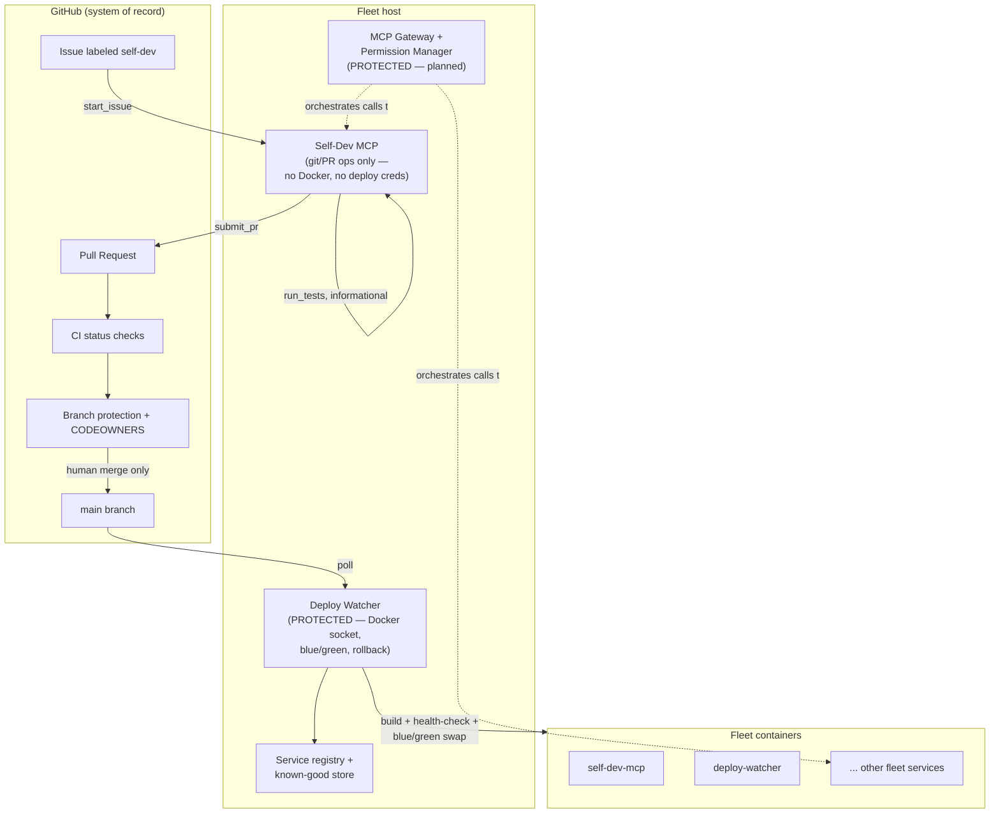

<p align="center">
  <picture>
    <source media="(prefers-color-scheme: dark)" srcset="assets/logo-dark.svg">
    
  </picture>
</p>

<p align="center">
  A self-developing fleet of MCP servers, with guardrails.
</p>

<p align="center">
  <a href="LICENSE"></a>
  <a href="CONTRIBUTING.md"></a>
</p>

Fleet MCP is a fleet of [Model Context Protocol](https://modelcontextprotocol.io)
servers that can read GitHub issues, edit its own source, open pull requests,
and — once a human merges the change — redeploy itself, without ever being
able to take the fleet down or disarm its own safety controls. The parts of
the system that could do real damage (the deploy pipeline, the permission
layer, the rule that defines what's off-limits) are structurally walled off
from the part that writes code, and enforced at more than one independent
layer.

This repository is the foundation of that system: the protected-core
enforcement engine, the Self-Dev MCP server, and the Deploy Watcher's
blue/green deploy and rollback machinery. It is real, tested code, not a
prototype — see [Status](#status--roadmap) below for exactly what's built and
what isn't yet.

## Why Fleet MCP

Most "self-modifying agent" demos either can't touch production or can touch
too much of it. Fleet MCP is built around one design principle: **the agent
reasons, MCP servers provide capabilities, and guardrails sit in between,
independent of the agent's own judgment.**

- The agent (any LLM-backed orchestrator, via the MCP gateway) decides *what*
  to build or fix.
- MCP servers like Self-Dev MCP expose narrow, auditable primitives — read a
  file, write a file, run tests, open a PR — not blanket shell access.
- Guardrails (the fleet manifest, workspace containment, the attempt cap,
  GitHub branch protection, credential scoping) sit *between* the agent's
  intent and anything irreversible, and they don't trust the agent's
  reasoning to hold. A prompt-injected or simply wrong agent still can't
  write to a protected path, still can't merge its own PR, and still can't
  touch a Docker socket.

The result is an agent that can fix its own bugs and extend its own fleet,
while every action that could take the system down or weaken its own
oversight goes through a human, a second system, or a hardcoded check that
the agent has no tool capable of editing.

## Key features

**Implemented today:**

- **Protected-core enforcement** (`services/common/manifest.py`) — a fleet
  manifest defines which services and paths are off-limits; two paths
  (`fleet_manifest.yaml` and the manifest loader itself) are protected
  unconditionally, regardless of what the manifest says. Path checks
  canonicalize separators and `..` segments and case-fold, so `..`,
  backslashes, and case tricks can't be used to escape the check.
- **Self-Dev MCP server** — a [FastMCP](https://github.com/modelcontextprotocol/python-sdk)
  server exposing `start_issue`, `read_file`, `write_file`, `run_tests`,
  `submit_pr`, `list_assigned_issues`, and `check_pr_status`. Every write is
  checked against the fleet manifest *and* confined to an ephemeral,
  per-issue workspace before it touches disk; absolute paths, drive letters,
  UNC paths, and `..` escapes are refused. A per-issue attempt cap (default
  5) stops runaway writes; a refused write never consumes an attempt.
- **No blast radius by design** — the Self-Dev MCP has no Docker socket
  access, no deploy credentials, and no tool that can merge a pull request.
  It can open and update PRs; it can never make them live.
- **Deploy Watcher** — polls `main` for new commits, builds each
  non-protected service from a fresh checkout of that commit, and performs a
  blue/green deploy: the new container must pass 3 consecutive health checks
  before it's promoted, and then survives a 30-minute probation window
  during which a single failed check triggers an automatic rollback to the
  last *proven* image. An image is only recorded as known-good after it
  clears probation, so a rollback can never target a build that hasn't
  actually been proven to work.
- **Resumable, non-destructive self-dev cycles** — re-invoking `start_issue`
  for an issue that already has an open PR resumes the same
  `selfdev/issue-N` branch instead of branching again, so follow-up commits
  land on the same PR. There is no force-push anywhere in the pipeline.

**Roadmap (not built yet — see [Status](#status--roadmap)):**

- MCP gateway and permission manager (the layer that sits between an
  orchestrating agent and every capability server, including Self-Dev MCP)
- `model-adapters-mcp` and `credentials-manager`, and the chat-side "Model
  Manager" flow for adding support for a new LLM backend on request
- Docker Compose / per-service Dockerfiles for running the fleet locally
- CI workflow and CODEOWNERS enforcing the human-review requirement at the
  platform level

## How it fits together



See [ARCHITECTURE.md](ARCHITECTURE.md) for the full component breakdown,
trust boundaries, and the rollback state machine.

## The protected core and the safety model

A small set of things can never be edited by the Self-Dev MCP, no matter
what an agent's reasoning concludes it should do:

- The **fleet manifest** (`fleet_manifest.yaml`) and the **manifest loader**
  (`services/common/manifest.py`) itself — the file that defines what's
  off-limits, and the code that reads it, are both hardcoded-protected. The
  Self-Dev MCP has no tool capable of editing either, even if the manifest
  were rewritten to claim they're safe.
- The **Deploy Watcher**, **permission manager** (planned), and **MCP
  gateway** (planned) services — marked `protected: true` in the manifest.
  These hold real authority (Docker socket access, routing, auth), so they
  are off-limits at the tool layer *and* would additionally require
  CODEOWNERS sign-off at the GitHub layer once branch protection is
  configured.

On top of that:

- **Workspace containment** — every `read_file`/`write_file` call is
  resolved against the current issue's ephemeral workspace; absolute paths,
  drive letters, UNC paths, and `..` segments are refused before anything
  touches disk.
- **No auto-merge, anywhere** — Self-Dev MCP can open and update a pull
  request; nothing in this codebase can merge one. Merging is a human
  action, backed by GitHub branch protection and CODEOWNERS once configured.
- **No deploy authority in Self-Dev MCP** — it holds no Docker socket, no
  deploy credentials, and never imports `docker`. Only the Deploy Watcher —
  a separate, protected service — can build an image or swap a container.
- **Known-good floor** — the Deploy Watcher only records an image as
  known-good after it survives a full probation window with zero failed
  checks. Rollback always targets that proven image, never a build that
  merely passed its first three health checks.

This is defense in depth, not a single check: even a bug in the manifest
parser doesn't expose the manifest file or the parser itself, because those
two paths are hardcoded rather than manifest-driven.

## Quickstart

### Run the test suite (works today)

```bash
git clone https://github.com/OWNER/fleet-mcp.git
cd fleet-mcp
python -m venv .venv && source .venv/bin/activate   # or .venv\Scripts\activate on Windows
pip install -r requirements.txt
python -m pytest tests -W error::DeprecationWarning
```

This runs the full suite for the protection engine, the Self-Dev MCP tools,
and the Deploy Watcher — including the adversarial tests that assert a
protected-path write is refused and a probation failure triggers rollback.

### Run the fleet locally (coming soon)

```bash
docker compose up
```

Per-service Dockerfiles and a `docker-compose.yml` are in progress — see
[Status](#status--roadmap). Once available, this will bring up the fixture
service, Self-Dev MCP, and Deploy Watcher against a local Docker daemon.

## Repo layout

```
services/
  common/manifest.py        fleet manifest loader + protected-path engine
  self_dev_mcp/              Self-Dev MCP: git ops, workspace, tools, server
  deploy_watcher/             Deploy Watcher: checkout, build, health, blue/green,
                                rollback, service registry, known-good store
tests/                      unit tests, mirroring the services/ layout
docs/superpowers/specs/     design specs for this system and its extensions
docs/superpowers/plans/     implementation plans
fleet_manifest.yaml         the fleet manifest (protected)
```

## Status / Roadmap

| Component | Status |
|---|---|
| Fleet manifest + protected-path engine | Built |
| Self-Dev MCP (7 tools, workspace containment, attempt cap) | Built |
| Deploy Watcher (blue/green, probation, rollback, known-good floor) | Built |
| Docker Compose + per-service Dockerfiles | In progress |
| CI workflow + CODEOWNERS | In progress |
| MCP gateway | Planned |
| Permission manager | Planned |
| `model-adapters-mcp` | Planned |
| `credentials-manager` | Planned |
| Model Manager chat flow | Planned |

Nothing in this table is aspirational marketing — if it says "Built," it has
passing tests in this repository today. If it says "Planned" or "In
progress," there is no working code for it yet.

## Documentation

- [ARCHITECTURE.md](ARCHITECTURE.md) — components, trust boundaries, the
  self-dev cycle, and the rollback state machine
- [SECURITY.md](SECURITY.md) — threat model, how to report a vulnerability,
  and known limitations
- [CONTRIBUTING.md](CONTRIBUTING.md) — dev setup, PR flow, and how to add a
  new fleet service
- [CODE_OF_CONDUCT.md](CODE_OF_CONDUCT.md)
- [GOVERNANCE.md](GOVERNANCE.md) — maintainers and decision-making
- [SUPPORT.md](SUPPORT.md) — where to ask for help
- [CHANGELOG.md](CHANGELOG.md)

## License

Apache License 2.0 — see [LICENSE](LICENSE) and [NOTICE](NOTICE).
