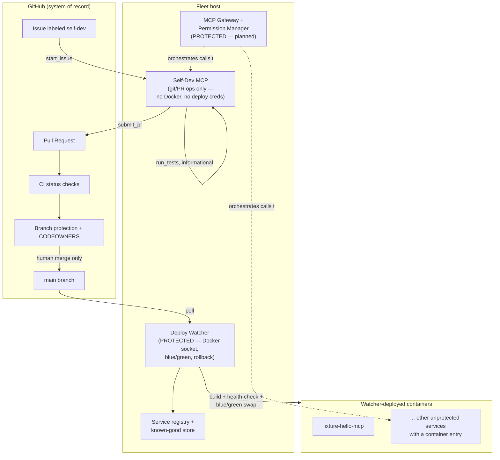

<p align="center">
  <picture>
    <source media="(prefers-color-scheme: dark)" srcset="assets/logo-dark.svg">
    
  </picture>
</p>

<p align="center">
  A self-developing fleet of MCP servers, with guardrails.
</p>

<p align="center">
  <a href="LICENSE"></a>
  <a href="CONTRIBUTING.md"></a>
</p>

Fleet MCP is a fleet of [Model Context Protocol](https://modelcontextprotocol.io)
servers that can read GitHub issues, edit its own source, open pull requests,
and — once a human merges the change — redeploy itself, without ever being
able to take the fleet down or disarm its own safety controls. The parts of
the system that could do real damage (the deploy pipeline, the permission
layer, the rule that defines what's off-limits) are structurally walled off
from the part that writes code, and enforced at more than one independent
layer.

This repository is the foundation of that system: the protected-core
enforcement engine, the Self-Dev MCP server, and the Deploy Watcher's
blue/green deploy and rollback machinery. It is real, tested code, not a
prototype — see [Status](#status--roadmap) below for exactly what's built and
what isn't yet.

## Install

Self-Dev MCP only:

```bash
pip install fleetmcp
```

Self-Dev MCP plus the Deploy Watcher (needs the Docker SDK):

```bash
pip install "fleetmcp[watcher]"
```

Or run it without installing anything, via [uvx](https://docs.astral.sh/uv/guides/tools/):

```bash
uvx fleetmcp
```

This installs three console scripts:

- `fleetmcp` and `fleetmcp-self-dev` (identical — two names for the same
  entry point) — the Self-Dev MCP server: `fleetmcp-self-dev --transport
  stdio|http` (default `stdio`; `--transport http` serves `/health` on port
  8080 for container health checks); `--version` prints the installed
  version.
- `fleetmcp-watcher` — the Deploy Watcher. Needs
  `pip install "fleetmcp[watcher]"`; without the `docker` package installed,
  it prints `fleetmcp-watcher needs the Docker SDK. Install it with: pip
  install "fleetmcp[watcher]"` and exits rather than crashing with an import
  traceback.

Self-Dev MCP reads its configuration from environment variables (see
[.env.example](.env.example) and
[fleetmcp/self_dev_mcp/config.py](fleetmcp/self_dev_mcp/config.py)):

| Variable | Required | Meaning |
|---|---|---|
| `SELF_DEV_GITHUB_TOKEN` | yes | fine-grained token (or bot token): contents, pull requests, and issues read/write on the target repo |
| `GITHUB_REPO_FULL_NAME` | yes | `owner/repo` |
| `SELF_DEV_REPO_REMOTE` | yes | git remote URL used for the clone/branch/commit/push workflow |
| `FLEET_MANIFEST_PATH` | no (default `fleet_manifest.yaml`) | path to the fleet manifest |
| `SELF_DEV_MAX_ATTEMPTS` | no (default `5`) | per-issue write attempt cap |
| `SELF_DEV_TEST_TIMEOUT_SECONDS` | no (default `600`) | `run_tests` timeout, in seconds |

Read
[SECURITY.md#preconditions-before-pointing-a-live-agent-at-a-repo](SECURITY.md#preconditions-before-pointing-a-live-agent-at-a-repo)
before pointing this at a repository you care about.

## Use with an MCP client

Both snippets below point `uvx` at the `fleetmcp` PyPI package and pass
configuration through environment variables — see
[SECURITY.md#preconditions-before-pointing-a-live-agent-at-a-repo](SECURITY.md#preconditions-before-pointing-a-live-agent-at-a-repo)
first.

### Claude Desktop

Add to your Claude Desktop config (`claude_desktop_config.json`):

```json
{
  "mcpServers": {
    "fleetmcp": {
      "command": "uvx",
      "args": ["fleetmcp"],
      "env": {
        "SELF_DEV_GITHUB_TOKEN": "<fine-grained token>",
        "GITHUB_REPO_FULL_NAME": "owner/repo",
        "SELF_DEV_REPO_REMOTE": "https://github.com/owner/repo.git",
        "FLEET_MANIFEST_PATH": "/path/to/fleet_manifest.yaml"
      }
    }
  }
}
```

### Claude Code

The `claude` CLI wasn't available in the environment this doc was written
in, so its exact `claude mcp add ... -e KEY=VALUE` flag syntax couldn't be
verified against a real `claude mcp add --help`; run that yourself before
scripting the command form. The JSON form above is not client-specific —
paste the same `mcpServers` block into whatever configuration surface your
`claude` CLI version reads for MCP servers.

## Why Fleet MCP

Most "self-modifying agent" demos either can't touch production or can touch
too much of it. Fleet MCP is built around one design principle: **the agent
reasons, MCP servers provide capabilities, and guardrails sit in between,
independent of the agent's own judgment.**

- The agent (any LLM-backed orchestrator, via the MCP gateway) decides *what*
  to build or fix.
- MCP servers like Self-Dev MCP expose narrow, auditable primitives — read a
  file, write a file, run tests, open a PR — not blanket shell access.
- Guardrails (the fleet manifest, workspace containment, the attempt cap,
  GitHub branch protection, credential scoping) sit *between* the agent's
  intent and anything irreversible. They work in two layers:
  - the **tool-level checks** stop a *cooperative* agent, one that only
    edits through `write_file`, from touching protected paths or `.git/`;
  - **GitHub branch protection plus a separate bot identity** is the real
    backstop against a *hostile* (e.g. prompt-injected) agent. `run_tests`
    executes code the agent wrote, with the self-dev token, so that code
    can write protected files into its PR branch or call the GitHub API
    directly. What stops it from reaching `main` is a required CI check and
    a required human (code-owner) review that the bot identity can't give
    itself. In either case Self-Dev MCP never holds a Docker socket.

The result is an agent that can fix its own bugs and extend its own fleet,
while every change that could take the system down or weaken its own
oversight has to pass a human review on GitHub, **provided** the
[preconditions](SECURITY.md#preconditions-before-pointing-a-live-agent-at-a-repo)
are in place.

## Key features

**Implemented today:**

- **Protected-core enforcement** (`fleetmcp/common/manifest.py`): a fleet
  manifest defines which services and paths are off-limits. A hardcoded
  core is protected no matter what the manifest says: the manifest, its
  loader, `fleetmcp/__init__.py`, `requirements.txt`,
  `requirements-dev.txt`, `docker-compose.yml`, `pyproject.toml`,
  `.gitattributes`, `.gitignore`, and the whole `fleetmcp/common/` and
  `.github/` trees. Path checks canonicalize
  separators, `..` segments, NTFS aliases and case, and are applied to the
  symlink-resolved target too.
- **Self-Dev MCP server**: a [FastMCP](https://github.com/modelcontextprotocol/python-sdk)
  server exposing `start_issue`, `read_file`, `write_file`, `run_tests`,
  `submit_pr`, `list_assigned_issues`, and `check_pr_status`. Every write is
  checked against the fleet manifest *and* confined to an ephemeral,
  per-issue workspace before it touches disk. Absolute paths, drive letters,
  UNC paths, `..` escapes and any `.git` path are refused, and each refusal
  is audit-logged. Every git call runs with hooks and fsmonitor disabled
  and pushes with an explicit, non-forcing refspec. A per-issue attempt cap
  (default 5) stops runaway writes; a refused write never consumes an
  attempt. These checks bind a cooperative agent; see
  [the safety model](#the-protected-core-and-the-safety-model) for what
  backs them up.
- **Limited blast radius**: the Self-Dev MCP has no Docker socket access,
  no deploy credentials, and no merge code path. It can open and update
  PRs. Making them live takes a human review enforced by GitHub branch
  protection, which is a
  [precondition](SECURITY.md#preconditions-before-pointing-a-live-agent-at-a-repo),
  not something this code can enforce.
- **Deploy Watcher** — polls `main` for new commits, builds each
  non-protected service that has a `container` entry in the manifest from a
  fresh checkout of that commit, and performs a
  blue/green deploy: the new container must pass 3 consecutive health checks
  before it's promoted, and then survives a 30-minute probation window
  during which a single failed check triggers an automatic rollback to the
  last *proven* image. An image is only recorded as known-good after it
  clears probation, so a rollback can never target a build that hasn't
  actually been proven to work.
- **Resumable, non-destructive self-dev cycles** — re-invoking `start_issue`
  for an issue that already has an open PR resumes the same
  `selfdev/issue-N` branch instead of branching again, so follow-up commits
  land on the same PR. There is no force-push anywhere in the pipeline.
- **Docker Compose + per-service Dockerfiles** — `docker-compose.yml` brings
  up the fixture service, Self-Dev MCP, and the Deploy Watcher on a
  dedicated `mcp-fleet` network, each with its own non-root Dockerfile and
  only the credentials/mounts it actually needs (see
  [Quickstart](#quickstart)).
- **Self-Dev MCP HTTP transport**: `--transport http` serves Self-Dev MCP
  over SSE (`/sse`, `/messages/`) plus `GET /health` on port 8080, which
  the compose healthcheck probes. Tools run in worker threads, so a long
  `run_tests` never blocks `/health`. `--transport stdio` (the default) is
  unchanged for local/CLI use. For this release self-dev-mcp is
  compose-managed (`docker compose up --build`), not redeployed by the
  Deploy Watcher.

**Roadmap (not built yet — see [Status](#status--roadmap)):**

- MCP gateway and permission manager (the layer that sits between an
  orchestrating agent and every capability server, including Self-Dev MCP)
- `model-adapters-mcp` and `credentials-manager`, and the chat-side "Model
  Manager" flow for adding support for a new LLM backend on request

## How it fits together



See [ARCHITECTURE.md](ARCHITECTURE.md) for the full component breakdown,
trust boundaries, and the rollback state machine.

## The protected core and the safety model

A small set of things can never be edited by the Self-Dev MCP, no matter
what an agent's reasoning concludes it should do:

- The **fleet manifest** (`fleet_manifest.yaml`), the **manifest loader**
  (`fleetmcp/common/manifest.py`) and everything else in `fleetmcp/common/`,
  plus the build/dependency files (`fleetmcp/__init__.py`,
  `requirements.txt`, `requirements-dev.txt`, `docker-compose.yml`,
  `pyproject.toml`, `.gitattributes`, `.gitignore`) and CI/CODEOWNERS
  (`.github/`). These are
  hardcoded-protected, so `write_file` refuses them even if the manifest
  were rewritten to claim they're safe.
- **Git metadata** (`.git/`): no tool can read or write it, and every git
  call runs with hooks and fsmonitor disabled and an explicit push refspec.
- The **Deploy Watcher**, **permission manager** (planned), and **MCP
  gateway** (planned) services — marked `protected: true` in the manifest.
  These hold real authority (Docker socket access, routing, auth), so they
  are off-limits at the tool layer *and* would additionally require
  CODEOWNERS sign-off at the GitHub layer — the workflow and CODEOWNERS file
  exist; enforcement requires branch protection, which the repo admin
  enables — see
  [CONTRIBUTING.md#enabling-branch-protection](CONTRIBUTING.md#enabling-branch-protection).

On top of that:

- **Workspace containment**: every `read_file`/`write_file`/`run_tests`
  call is resolved against the current issue's ephemeral workspace.
  Absolute paths, drive letters, UNC paths, `..` segments, and symlinks or
  junctions that lead to a protected or outside path are refused before
  anything touches disk.
- **No merge code path**: Self-Dev MCP can open and update a pull request,
  and nothing in this codebase calls a merge API. The self-dev token *could*
  merge through the API, though, so merge-by-a-human-only is enforced by
  GitHub branch protection and CODEOWNERS. The workflow and CODEOWNERS file
  exist; the repo admin enables branch protection (see
  [CONTRIBUTING.md#enabling-branch-protection](CONTRIBUTING.md#enabling-branch-protection)).
- **No deploy authority in Self-Dev MCP** — it holds no Docker socket, no
  deploy credentials, and never imports `docker`. Only the Deploy Watcher —
  a separate, protected service — can build an image or swap a container.
- **Known-good floor** — the Deploy Watcher only records an image as
  known-good after it survives a full probation window with zero failed
  checks. Rollback always targets that proven image, never a build that
  merely passed its first three health checks.

This is defense in depth, not a single check: even a bug in the manifest
parser doesn't expose the manifest file or the parser itself, because those
paths are hardcoded rather than manifest-driven.

**What the tool checks do *not* stop.** They bind a *cooperative* agent.
`run_tests` executes code the agent wrote, with the self-dev token. That
code can write any file (protected ones included), which `submit_pr`'s
`git add -A` then commits to the PR branch, and it can call the GitHub API
directly. The backstop is GitHub branch protection (required `test` check,
required review, code-owner review, `enforce_admins`) plus a **separate
bot identity** for self-dev. With the owner's own PAT, self-dev PRs are
authored by the owner, and a sole owner can't approve their own PR under
`enforce_admins`. See [SECURITY.md](SECURITY.md#known-limitations).

## Quickstart

### Run the test suite (works today)

```bash
git clone https://github.com/OmPrakashSingh1704/fleet-mcp.git
cd fleet-mcp
python -m venv .venv && source .venv/bin/activate   # or .venv\Scripts\activate on Windows
pip install -r requirements-dev.txt
python -m pytest tests -m "not docker" -v -W error::DeprecationWarning -W error::pytest.PytestUnhandledCoroutineWarning
```

`requirements-dev.txt` pulls in `requirements.txt` plus the packaging tools
(`build`, `twine`, `hatchling`, `hatch-fancy-pypi-readme`) that
`tests/test_packaging.py` needs to build a wheel as part of the suite.

(`-m docker` runs the Docker integration test separately; it needs a
reachable Docker daemon.)

This runs the full suite for the protection engine, the Self-Dev MCP tools,
and the Deploy Watcher — including the adversarial tests that assert a
protected-path write is refused and a probation failure triggers rollback.

### Run the fleet locally

> **Precondition before pointing a live agent at a repo:** enable branch
> protection on `main` (required `test` check, required review, code-owner
> review, `enforce_admins`) **and** give self-dev its own bot identity (a
> machine user or GitHub App), not your own PAT. On a private repo, branch
> protection needs GitHub Pro, Team or Enterprise. See
> [SECURITY.md](SECURITY.md#preconditions-before-pointing-a-live-agent-at-a-repo).
> Running the stack with placeholder values to look around is fine.

```bash
cp .env.example .env
# edit .env: set SELF_DEV_GITHUB_TOKEN, WATCHER_GITHUB_TOKEN,
# GITHUB_REPO_FULL_NAME, REPO_REMOTE, SELF_DEV_REPO_REMOTE
docker compose up --build
```

`SELF_DEV_GITHUB_TOKEN` (fine-grained: contents, pull requests and issues
read/write on this repo) and `WATCHER_GITHUB_TOKEN` (contents read-only) are
separate tokens. The old shared `GITHUB_TOKEN` variable is no longer read.
Git authenticates with them through a credential helper, so never put a
token in a remote URL.

This brings up three containers on the `mcp-fleet` network:

- **fixture-hello-mcp** — `http://localhost:8081/health` — a minimal Flask
  service used as the Deploy Watcher's local smoke-test target.
- **self-dev-mcp** — `http://127.0.0.1:8082/health` (bound to loopback only,
  not published to other hosts — see
  [SECURITY.md](SECURITY.md#known-limitations)) — the Self-Dev MCP server
  over `--transport http`. Compose-managed: after merging a change to it,
  update it with `docker compose up --build self-dev-mcp`. The Deploy
  Watcher does not redeploy it.
- **deploy-watcher** — no published port; it only talks outbound to GitHub
  and to the Docker daemon via the mounted `docker.sock`.

With placeholder `.env` values (or real ones that just don't resolve),
`fixture-hello-mcp` and `self-dev-mcp` still start and their `/health`
checks still pass — GitHub credentials are only resolved lazily, on the
first tool call that actually needs them. Any Self-Dev MCP tool that talks
to GitHub (`list_assigned_issues`, `submit_pr`, `check_pr_status`, ...) will
return an `"ERROR: ..."` string until `SELF_DEV_GITHUB_TOKEN` and
`GITHUB_REPO_FULL_NAME` are set to real values.

## Repo layout

```
fleetmcp/
  common/manifest.py        fleet manifest loader + protected-path engine
  self_dev_mcp/              Self-Dev MCP: git ops, workspace, tools, server,
                                Dockerfile
  deploy_watcher/             Deploy Watcher: checkout, build, health, blue/green,
                                rollback, service registry, known-good store,
                                Dockerfile, entrypoint.sh
  fixture_hello_mcp/          fixture Flask service + Dockerfile, used as the
                                Deploy Watcher's local smoke-test target
tests/                      unit tests, mirroring the fleetmcp/ layout
docs/design/                design documents (historical / planned; code and
                              ARCHITECTURE.md are authoritative)
fleet_manifest.yaml         the fleet manifest (protected)
docker-compose.yml          local fleet: mcp-fleet network + all three services (protected)
.env.example                template for the .env docker-compose reads secrets from
```

## Status / Roadmap

| Component | Status |
|---|---|
| Fleet manifest + protected-path engine | Built |
| Self-Dev MCP (7 tools, workspace containment, attempt cap) | Built |
| Deploy Watcher (blue/green, probation, rollback, known-good floor) | Built |
| Docker Compose + per-service Dockerfiles | Built |
| Self-Dev MCP HTTP transport (`--transport http`) | Built |
| CI workflow + CODEOWNERS | Built (the CODEOWNERS owner is a placeholder — `@OWNER` — and branch protection must still be enabled by the repo admin; see [CONTRIBUTING.md#enabling-branch-protection](CONTRIBUTING.md#enabling-branch-protection)) |
| MCP gateway | Planned |
| Permission manager | Planned |
| `model-adapters-mcp` | Planned |
| `credentials-manager` | Planned |
| Model Manager chat flow | Planned |

Nothing in this table is aspirational marketing — if it says "Built," it has
passing tests in this repository today. If it says "Planned" or "In
progress," there is no working code for it yet.

The one thing "Built" doesn't cover automatically: a real run against your
own GitHub repo (a live PR, CI, and merge). See
[docs/acceptance-checklist.md](docs/acceptance-checklist.md) for that manual
verification pass.

## Documentation

- [ARCHITECTURE.md](ARCHITECTURE.md) — components, trust boundaries, the
  self-dev cycle, and the rollback state machine
- [SECURITY.md](SECURITY.md) — threat model, how to report a vulnerability,
  and known limitations
- [CONTRIBUTING.md](CONTRIBUTING.md) — dev setup, PR flow, and how to add a
  new fleet service
- [CODE_OF_CONDUCT.md](CODE_OF_CONDUCT.md)
- [GOVERNANCE.md](GOVERNANCE.md) — maintainers and decision-making
- [SUPPORT.md](SUPPORT.md) — where to ask for help
- [CHANGELOG.md](CHANGELOG.md)
- [RELEASING.md](RELEASING.md) — how a `fleetmcp` release is cut and
  published to PyPI

## License

Apache License 2.0 — see [LICENSE](LICENSE) and [NOTICE](NOTICE).
