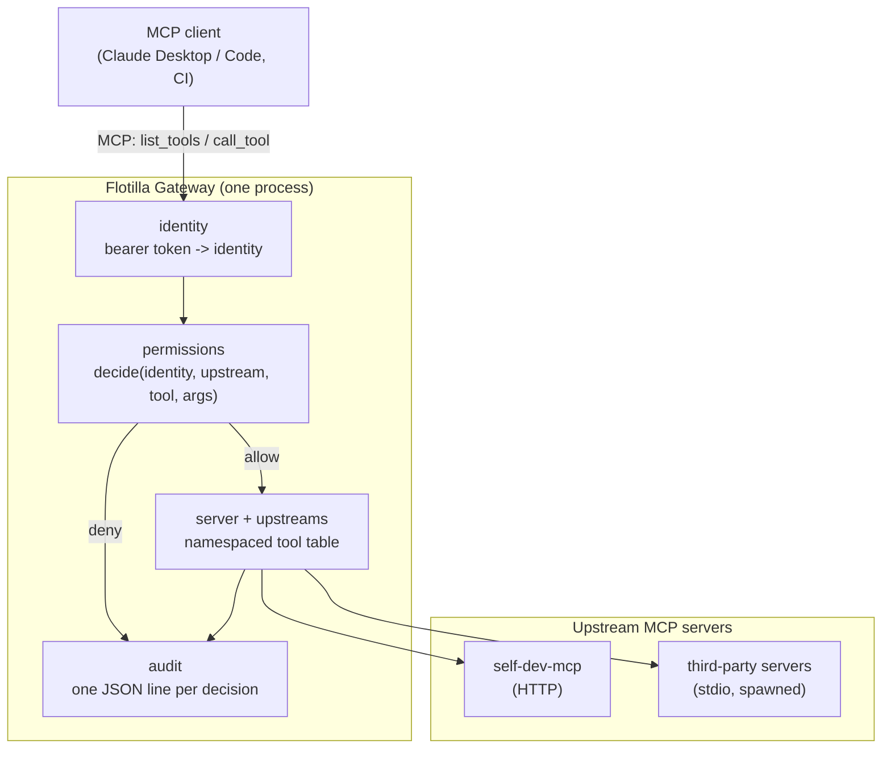

# MCP Gateway and Permission Manager — Design Spec

Date: 2026-09-23
Status: approved design, pending implementation plan

## Purpose

Put one authenticated, policy-enforcing endpoint in front of every MCP server in the
fleet. Clients (Claude Desktop, Claude Code, CI jobs, any MCP client) connect to the
gateway instead of to individual servers. The gateway authenticates the caller,
aggregates the fleet's tools into a single list, checks every call against policy,
records it in an audit trail, and forwards it to the right upstream server.

This closes the hole SECURITY.md currently documents: the Self-Dev MCP HTTP/SSE endpoint
has no authentication of its own, so anyone who can reach it can drive every tool. After
this, no fleet server is published directly; the gateway is the only front door.

## Decisions (made with the product owner)

- **Shape:** an MCP proxy in front of the fleet, not an in-process library and not a
  per-server sidecar. One endpoint, one choke point, one audit trail.
- **Client authentication:** bearer tokens, one per named client. No external identity
  provider. OAuth 2.1 per the MCP authorization spec is roadmap, not v1.
- **Policy outcomes in v1:** allow and deny only. `NeedsApproval` is representable in the
  policy format and rejected at call time with an explicit message, so adding a real
  approval channel later does not change the file format.
- **Split:** one service, two modules. The permission manager is a module inside the
  gateway with a narrow interface, not a separate network service. Extracting it later is
  contained because the interface already exists.
- **Policy location:** its own protected config file, not inside `fleet_manifest.yaml`.
- **Upstream transports:** both stdio (spawned subprocesses) and HTTP from the start, so
  the gateway can front third-party MCP servers as well as the fleet's own containers.
- **SDK version:** the `mcp` upgrade lands first, as its own change, before any gateway
  code is written.

## Prerequisite: SDK upgrade

The project is pinned to `mcp>=1.2,<1.3` because `build_http_app` mirrors private
internals of `FastMCP.run_sse_async` from 1.2.0. That pin has to go before this work
starts, for two reasons:

- 1.2.0 carries nine known advisories, including *HTTP transports serve session requests
  without verifying the authenticated principal* and *no DNS-rebinding protection by
  default* — the exact class of problem a gateway exists to fix. Building a security
  component on it would be indefensible.
- The client-side APIs this design needs for upstream connections are materially better
  in current versions.

The upgrade is a separate change: move `mcp`, `starlette`, `anyio` and `requests` to
current, replace the private-internals mirror with the SDK's public app, keep behaviour
identical, and clear the corresponding Dependabot alerts. It ships as 0.2.0. The gateway
ships as 0.3.0.

## Architecture



The gateway is an MCP server to clients and an MCP client to each upstream, using the
official SDK on both sides so protocol concerns (initialize, capability negotiation,
notifications, cancellation) stay the SDK's problem.

Two run modes:

- `--transport stdio`: a local process a desktop client spawns. The caller is the
  spawning process, so identity is fixed as `local` and no token is required.
- `--transport http`: a long-running service. Callers present a bearer token; the token's
  name is the identity policy is written against.

## Components

All under `flotilla_mcp/gateway/`:

- **`server.py`** — the client-facing MCP server. Aggregates upstream tools into one list,
  namespaced `<upstream>__<tool>` (e.g. `selfdev__write_file`) so two upstreams may both
  expose `read_file`. Implements `list_tools` and `call_tool`.
- **`upstreams.py`** — the connection registry. One SDK `ClientSession` per upstream:
  a spawned subprocess for stdio, an HTTP session for containerized servers. Owns connect,
  tool-list refresh, crash detection and restart with backoff.
- **`identity.py`** — bearer-token authentication. Only token *hashes* are stored. A CLI
  subcommand mints a token for a named client and prints it once.
- **`permissions.py`** — the permission manager. One entry point:
  `decide(identity, upstream, tool, arguments) -> Allow | Deny | NeedsApproval`.
  Default deny. Pure and side-effect free, so it is unit-testable without a gateway.
- **`audit.py`** — one JSON line per decision: timestamp, identity, upstream, tool,
  decision, reason, duration, error class. Argument **names** only, never values, so file
  contents and credentials cannot leak into the log.
- **`cli.py`** — `flotilla-gateway` console script: run the server, mint client tokens,
  validate the config, reload.

### Configuration: `gateway.yaml`

One protected file, three sections:

```yaml
upstreams:
  selfdev:
    transport: http
    url: http://self-dev-mcp:8080/sse
  filesystem:
    transport: stdio
    command: uvx
    args: ["mcp-server-filesystem", "/srv/data"]
    env: {}                      # values may reference ${ENV_VAR}

clients:
  ide-laptop:
    token_sha256: "<hash>"       # minted by `flotilla-gateway add-client`
  ci-bot:
    token_sha256: "<hash>"

policy:
  default: deny                  # the only supported default in v1
  identities:
    ide-laptop:
      allow:
        - upstream: selfdev
          tools: ["*"]
        - upstream: filesystem
          tools: ["read_*"]
    ci-bot:
      allow:
        - upstream: selfdev
          tools: ["list_assigned_issues", "check_pr_status"]
    local:                       # stdio mode
      allow:
        - upstream: "*"
          tools: ["*"]
```

`gateway.yaml` joins the always-protected paths in `flotilla_mcp/common/manifest.py` and
`.github/CODEOWNERS`, so Self-Dev MCP can never edit the rules that constrain it — the
same protection the fleet manifest already has.

## Call flow

**Startup.** Read and validate `gateway.yaml`. Connect to each upstream, spawning stdio
processes and opening HTTP sessions. Call `list_tools` on each and build the namespaced
tool table. An upstream that fails to connect is marked unavailable and retried in the
background; it must not prevent the gateway from serving the others.

**`list_tools`.** Authenticate, then return only the tools that identity may call. A
client never sees a tool it would be refused, so the model does not plan around
unavailable capabilities. Descriptions and schemas pass through unchanged from upstream.

**`call_tool`.**

1. Authenticate the bearer token (or take `local` in stdio mode). Unknown token → reject
   and audit.
2. Resolve `<upstream>__<tool>` to a connection. Unknown name → reject and audit.
3. `permissions.decide(...)`:
   - `Deny` → return `ERROR: denied by policy: <rule>`, audit.
   - `NeedsApproval` → return `ERROR: requires approval, not supported yet`, audit.
4. Forward to the upstream session and await the result, subject to the per-call timeout.
5. Audit the outcome and duration; return the upstream's result to the client verbatim.

Policy is always evaluated in the gateway, never by the upstream. Upstream servers stay
plain MCP servers with no knowledge of identity.

**Reload.** `gateway.yaml` is re-read on SIGHUP and via a `reload` CLI command, so
revoking a token or tightening a rule does not require a restart that would kill in-flight
stdio upstreams.

## Error handling and edge cases

- **Upstream down or crashed:** that call returns `ERROR: upstream '<name>' unavailable`;
  other upstreams are unaffected. Crashed stdio processes are respawned with backoff, and
  the tool list refreshes on reconnect.
- **Upstream hangs:** per-call timeout (default 120s, per-upstream override) so one stuck
  server cannot pin a client indefinitely.
- **Invalid policy at startup:** refuse to start. A gateway with unparseable policy must
  never fall back to permissive.
- **Invalid policy on reload:** keep the previous policy, log loudly, stay up. A typo must
  not take the fleet offline.
- **No policy entry for an identity:** deny.
- **Authentication failures:** logged with the token *name* when recognised, never the
  token material, plus the client address.
- **Never raise to a client:** every failure is an `ERROR: ...` tool result, matching the
  never-raise contract the rest of the codebase follows.
- **Tool-name collisions:** namespacing makes them impossible across upstreams; an
  upstream whose own tool name already contains the separator is rejected at startup with
  a clear message.

## Testing

- **Unit:** policy decisions including default-deny, pattern matching and rule precedence;
  token hashing and verification; tool-name namespacing and collision rejection; audit
  record shape, asserting argument values never appear.
- **Integration with a real upstream:** run the fixture MCP server as a stdio upstream and
  drive the gateway end to end — list tools, call an allowed tool, get refused on a denied
  one, and assert both outcomes in the audit log.
- **Failure paths:** kill an upstream mid-session and assert the error result and
  subsequent recovery; unparseable policy at startup and on reload.
- **Security tests that must never regress:**
  - an unauthenticated call is refused;
  - a token for identity A cannot call a tool only B may use;
  - a denied tool is absent from `list_tools`;
  - the audit log never contains argument values or token material.
- **Docker:** the gateway gets a Dockerfile and a compose entry fronting the fleet, and
  the self-dev server's port is no longer published directly.

## Out of scope

- Approval workflows (the `NeedsApproval` outcome is representable but rejected in v1).
- OAuth 2.1 / external identity providers.
- Rate limiting and quotas.
- Multi-tenant deployments: v1 assumes one operator's fleet.
- The credentials manager and model adapters, which have their own spec.
